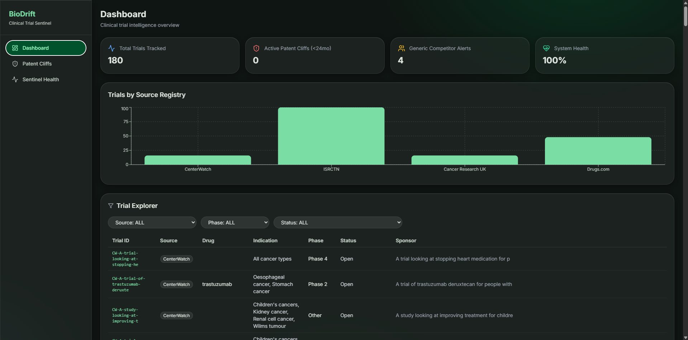
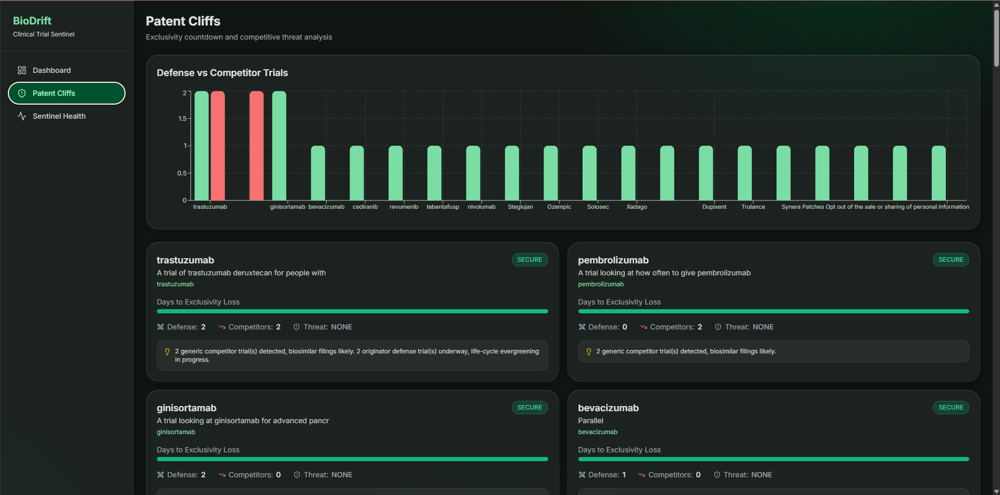
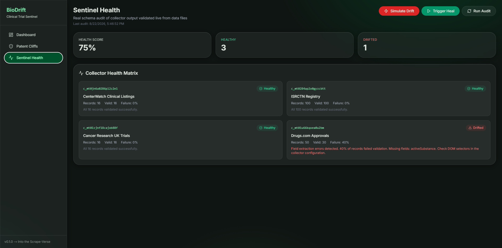
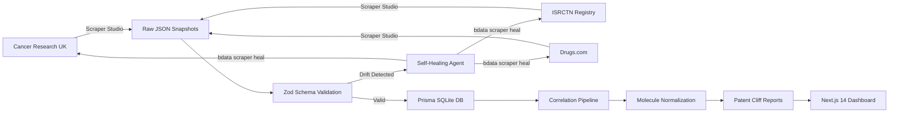

<div align="center">
<h1>BioDrift</h1>

> **Autonomous Clinical Trial Sentinel & Drug Patent Cliff Intelligence Engine**

<p>


</p>

<h4><b>Into the Scrape-Verse Hackathon</b> organized with WeMakeDevs</h4>

</div>

---

## The Problem: Fragmented Registries Break Everything

Biotech researchers and investors face a **$2.8 billion problem**: tracking clinical trial progression and expiring drug patents across **fragmented global registries** that constantly change layouts, break scrapers, and require manual monitoring.

### Why Traditional Scrapers Fail

```
┌─────────────────────────────────────────────────────────────────────┐
│  ❌ THE OLD WAY (Fragile)                                            │
│                                                                     │
│  CSS Selector: ".trial-status-badge"                                │
│       ↓                                                             │
│  Registry updates DOM → Selector breaks → Scraper returns null      │
│       ↓                                                             │
│  Silent failure → Data corruption → Bad investment decisions        │
└─────────────────────────────────────────────────────────────────────┘
```

### The BioDrift Solution: Autonomous Self-Healing

```
┌─────────────────────────────────────────────────────────────────────┐
│  ✅ THE BIODRIFT WAY (Autonomous)                                   │
│                                                                     │
│  Zod Schema Contract: { trialStatus: z.string().min(1) }            │
│       ↓                                                             │
│  Registry updates DOM → Schema detects drift → Triggers heal        │
│       ↓                                                             │
│  bdata scraper heal repairs scraper → Data flows again → Zero downtime│
└─────────────────────────────────────────────────────────────────────┘
```

**BioDrift doesn't just scrape, it heals itself.**

---

## Screenshots

<table>
  <tr>
    <td></td>
    <td></td>
    <td></td>
  </tr>
</table>

---

## Architecture



### Project Structure

```
biodrift/
├── packages/scraper-service/
│   ├── src/
│   │   ├── schema.ts              # Zod validation schemas (4 sources)
│   │   ├── fetch-all.ts           # Bright Data API ingestion (parallel)
│   │   ├── heal.agent.ts          # Self-healing validation daemon
│   │   ├── combine-pipeline.ts    # Correlation engine
│   │   └── seed.ts                # Database seeder
│   ├── prisma/
│   │   └── schema.prisma          # Relational schema (4 models)
│   └── data/raw/                  # Collector snapshots
├── apps/web/
│   ├── app/
│   │   ├── dashboard/             # Metrics + trial explorer
│   │   ├── patent-cliffs/         # Countdown cards + charts
│   │   └── sentinel-health/       # Health matrix + drift simulation
│   └── data/                      # Unified dashboard data
└── package.json                   # Workspace root
```

---

## Bright Data Scraper Studio Integration

BioDrift integrates with **Bright Data Scraper Studio** for autonomous data collection across multiple clinical trial and drug registries.

### Active Collectors

| Collector ID           | Registry            | Description                    |
| ---------------------- | ------------------- | ------------------------------ |
| `c_mt0jn6u0286pl2z2e1` | CenterWatch         | Cancer clinical trial listings |
| `c_mt01u66kqoea0u2bm`  | ISRCTN Registry     | International trial registry   |
| `c_mt01zjnf18cajob88f` | Cancer Research UK  | CRUK trial search results      |
| `c_mt0284ap2o0gyzcbtt` | Drugs.com           | New drug approvals             |
| `c_mt0k33i5f1647sgw3`  | Drugs.com Drug Info | Comprehensive drug information |

### Ingestion Pipeline

```typescript
// fetch-all.ts -> Parallel ingestion with auto-retry
const COLLECTORS = {
  centerwatch: process.env.BRIGHTDATA_COLLECTOR_CW,
  isrctn: process.env.BRIGHTDATA_COLLECTOR_ISRCTN,
  cancer_research_uk: process.env.BRIGHTDATA_COLLECTOR_CRUK,
  drug_approvals: process.env.BRIGHTDATA_COLLECTOR_DRUGS,
};
```

**Two ingestion modes:**

1. **Mock Mode** (`USE_MOCK_DATA=true`): Pre-seeded JSON for offline development
2. **Live Mode** (`USE_MOCK_DATA=false`): Bright Data REST API with parallel polling

### CLI Commands Used

```bash
# 1. CREATE a collector via AI-powered generation
bdata scraper create https://www.cancerresearchuk.org/about-cancer/find-a-clinical-trial \
  "Extract trial titles, cancer type, phase, recruitment status, and summary" \
  --name "Cancer Research UK Trials"

# 2. RUN the collector
bdata scraper run c_mt01zjnf18cajob88f

# 3. HEAL a broken collector when drift is detected
bdata scraper heal c_mt01zjnf18cajob88f \
  "Re-extract trialPhase from updated result cards container"

# 4. APPROVE or REJECT the heal
bdata scraper approve c_mt01zjnf18cajob88f
```

### REST API Integration

```typescript
// fetch-all.ts -> Parallel ingestion with auto-retry
const COLLECTORS = {
  centerwatch: process.env.BRIGHTDATA_COLLECTOR_CW, // c_mt0jn6u0286pl2z2e1
  isrctn: process.env.BRIGHTDATA_COLLECTOR_ISRCTN, // c_mt0284ap2o0gyzcbtt
  cancer_research_uk: process.env.BRIGHTDATA_COLLECTOR_CRUK, // c_mt01zjnf18cajob88f
  drug_approvals: process.env.BRIGHTDATA_COLLECTOR_DRUGS, // c_mt01u66kqoea0u2bm
};
```

```bash
# Trigger a collector via REST API
POST https://api.brightdata.com/dca/trigger?collector={collectorId}&queue_next=1
Authorization: Bearer {API_TOKEN}

# Poll for results
GET https://api.brightdata.com/dca/dataset?id={snapshotId}
Authorization: Bearer {API_TOKEN}
```

---

## Step-by-Step Self-Healing Flow

BioDrift's self-healing agent continuously validates scraped data against strict Zod schema contracts. When drift is detected, it autonomously triggers repairs without human intervention.

### The Flow (6 Steps)

```
┌─────────────────────────────────────────────────────────────────────┐
│  STEP 1: Raw JSON Ingest                                            │
│     Bright Data Scraper Studio returns JSON from scraped pages      │
│     ↓                                                               │
│  STEP 2: Zod Schema Contract Check                                  │
│     Each record validated against strict TypeScript types           │
│     ↓                                                               │
│  STEP 3: Drift Detection (>30% failure rate)                        │
│     Missing fields, null values, or schema violations               │
│     ↓ YES → Continue | NO → Mark HEALTHY                            │
│  STEP 4: Generate Diagnostic Prompt                                 │
│     "Field 'trialPhase' missing from 45% of records"                │
│     ↓                                                               │
│  STEP 5: Execute Self-Heal                                          │
│     bdata scraper heal <collectorId> "<diagnostic>"                 │
│     ↓                                                               │
│  STEP 6: Scraper Repaired In-Place                                  │
│     AI updates DOM selectors without code changes                   │
└─────────────────────────────────────────────────────────────────────┘
```

### How It Works (Code)

```typescript
// heal.agent.ts -> Core validation loop
function validateSource(name: string, config: CollectorConfig): HealResult {
  const { schema, collectorId } = config;

  // Load raw JSON from Bright Data
  const records = loadRawJSON(name);

  let failures = 0;
  const failedFields: string[] = [];

  for (const record of records) {
    const result = schema.safeParse(record);
    if (!result.success) {
      failures++;
      failedFields.push(...result.error.issues.map((i) => i.path.join(".")));
    }
  }

  const failureRate = failures / records.length;

  if (failureRate > 0.3) {
    // DRIFT DETECTED: trigger self-heal
    return {
      collectorId: collectorId, // Real c_xxxxxx ID
      status: "DRIFT_DETECTED",
      diagnostic: `Field extraction errors: ${[...new Set(failedFields)].join(", ")}`,
    };
  }

  return { collectorId, status: "HEALTHY" };
}
```

### Test Self-Healing

```bash
# 1. Run the self-healing validation
npm run heal

# Output shows real collector IDs:
# [heal] ✅ c_mt01zjnf18cajob88f: HEALTHY
# [heal] 🔧 c_mt0284ap2o0gyzcbtt: AUTO_HEALED
# [heal] ✅ c_mt01u66kqoea0u2bm: HEALTHY
# [heal] ✅ c_mt0jn6u0286pl2z2e1: HEALTHY

# 2. Navigate to Sentinel Health dashboard
npm run dev
# Open http://localhost:3000/sentinel-health

# 3. Click "Simulate DOM Drift & Heal" button
# Watch real-time status badges update:
# 🟢 Healthy → 🔴 Drifted → 🟡 Healing → 🟢 Auto-Healed
```

### Real Example: Healing a Broken Scraper

```bash
# Scenario: Cancer Research UK updates their HTML structure
# The "trialPhase" field moves from <span class="phase"> to <div data-phase>

# BioDrift detects the drift:
[heal] Drift detected for c_mt01zjnf18cajob88f
[heal] Diagnostic: Field 'trialPhase' missing from 45% of records

# BioDrift triggers the heal:
bdata scraper heal c_mt01zjnf18cajob88f \
  "Re-extract trialPhase from updated DOM structure - field moved from span.phase to div[data-phase]"

# Bright Data AI updates the scraper selectors automatically
# Data flows again, zero human intervention required
```

---

## Multi-Source Correlation Engine

### Molecule Sanitization

BioDrift normalizes drug names across disparate registries using the `sanitizeMoleculeName()` function:

```typescript
export function sanitizeMoleculeName(name: string): string {
  return name
    .replace(/\(.*?\)/g, "") // Remove brand names: "Keytruda (pembrolizumab)" → "pembrolizumab"
    .replace(/\b(Plus|and|\/)\b/gi, "") // Remove conjunctions
    .replace(/\d+\s*mg/gi, "") // Remove dosages
    .trim()
    .toLowerCase();
}
```

This enables cross-referencing trials from ISRCTN and Cancer Research UK with Drugs.com patent data using **International Nonproprietary Names (INN)**.

### Loss of Exclusivity (LOE) Calculator

```typescript
function computeDaysToCliff(expiryDate: string): number {
  const now = new Date();
  const expiry = new Date(expiryDate);
  return Math.ceil((expiry.getTime() - now.getTime()) / (1000 * 60 * 60 * 24));
}

function getCliffStatus(days: number): CliffStatus {
  if (days <= 730) return "CRITICAL_CLIFF"; // ≤2 years
  if (days <= 1460) return "APPROACHING"; // ≤4 years
  return "SECURE";
}
```

### Threat Intelligence Metrics

| Metric                        | Description                                                                      |
| ----------------------------- | -------------------------------------------------------------------------------- |
| **Days to Cliff**             | Days remaining until patent exclusivity expires                                  |
| **Cliff Status**              | `CRITICAL_CLIFF` (≤2yr), `APPROACHING` (≤4yr), `SECURE`                          |
| **Generic Competitor Trials** | Count of Phase 3 trials by non-originator sponsors                               |
| **Originator Defense Trials** | Count of new trials by patent holder expanding indications                       |
| **Threat Level**              | `HIGH`, `MEDIUM`, `LOW`, `NONE` — based on cliff proximity + competitor activity |

---

## Dashboard UI

### `/dashboard` : Clinical Trial Intelligence

- **Summary Metrics**: Total trials tracked (180+), active patent cliffs (<24mo), generic competitor alerts, system health
- **Source Distribution Chart**: Bar chart showing trial counts by registry
- **Trial Explorer**: Filterable table with source, phase, status, sponsor, and indication columns

### `/patent-cliffs` : Exclusivity Countdown

- **Countdown Cards**: Trade name, active substance, authorization holder
- **Progress Bars**: Visual timeline from authorization to expiry
- **Defense vs Competitor Chart**: Side-by-side comparison of originator defense trials and generic competitor trials
- **Threat Insights**: AI-generated intelligence strings

### `/sentinel-health` : Scraper Health Matrix

- **Collector Status**: Real-time health badges for all 4 collectors (real `c_xxxxxx` IDs)
- **Healing Audit Log**: Timestamped record of all drift detection and repair events
- **Drift Simulation**: Interactive button to test the self-healing loop

---

## Quickstart

### Prerequisites

- **Node.js** >= 18
- **npm** (comes with Node.js)

### Setup

```bash
# Clone the repository
git clone https://github.com/your-username/biodrift.git
cd biodrift

# Install dependencies
npm install

# Set up environment
cp .env.example .env
# Edit .env with Bright Data API token (or keep USE_MOCK_DATA=true)

# Initialize database
npx prisma db push --schema=packages/scraper-service/prisma/schema.prisma

# Seed raw data
npm run seed

# Run correlation pipeline
npm run combine

# Start development server
npm run dev
```

Open [http://localhost:3000](http://localhost:3000) to view the dashboard.

### Environment Variables

```env
# .env.example
USE_MOCK_DATA=true                    # Set to false for live scraping

# Database
DATABASE_URL="file:./biodrift.db"

# Bright Data (only needed when USE_MOCK_DATA=false)
BRIGHTDATA_API_TOKEN=your_api_token_here
BRIGHTDATA_COLLECTOR_CW=your_collector_id
BRIGHTDATA_COLLECTOR_ISRCTN=your_collector_id
BRIGHTDATA_COLLECTOR_CRUK=your_collector_id
BRIGHTDATA_COLLECTOR_DRUGS=your_collector_id
```

### Available Scripts

| Command           | Description                          |
| ----------------- | ------------------------------------ |
| `npm run fetch`   | Trigger collectors (mock or live)    |
| `npm run seed`    | Validate and populate database       |
| `npm run combine` | Run correlation pipeline             |
| `npm run heal`    | Validate schemas and auto-heal drift |
| `npm run dev`     | Start Next.js dashboard              |
| `npm run build`   | Production build                     |
| `npm run studio`  | Open Prisma Studio                   |

---

## Tech Stack

| Layer            | Technology                                                              |
| ---------------- | ----------------------------------------------------------------------- |
| **Frontend**     | Next.js 14 (App Router), React 18, Tailwind CSS, Recharts, Lucide Icons |
| **Backend**      | Node.js, TypeScript, Zod (schema validation)                            |
| **Database**     | Prisma ORM, SQLite                                                      |
| **Scraping**     | Bright Data Scraper Studio (CLI + REST API)                             |
| **Self-Healing** | Autonomous `bdata scraper heal` daemon                                  |

---

## Demo Mode

BioDrift ships with **cached snapshot data** for offline development and evaluation:

```bash
# Run entirely offline (uses cached JSON snapshots)
USE_MOCK_DATA=true npm run seed && npm run combine && npm run dev
```

The cached data includes:

- **16 CenterWatch trials** (oncology clinical trials)
- **100 ISRCTN trials** (international trial registry)
- **16 Cancer Research UK trials** (CRUK search results)
- **50 Drugs.com approvals** (recent drug approvals)

---

## Links

- **[Demo Video Link](#)**
- **[Live Demo Link](#)**

---

## License

**[MIT](LICENSE)**

---

## Acknowledgements

- **[Bright Data](https://brightdata.com)**: Scraper Studio infrastructure for autonomous data collection
- **[WeMakeDevs](https://wemakedevs.org)**: Hackathon organization and community support
- **Opencode**: Coding assistant, under my supervision.
- **Gemini 3.7 Flash**: Research and text formatting, under my supervision.
- **ElevenLabs**: Voice-over in the demo video.
