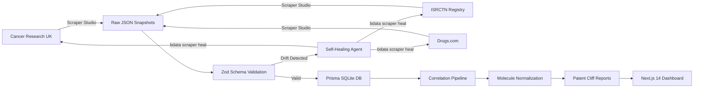

# BioDrift

> **Autonomous Clinical Trial Sentinel & Drug Patent Cliff Intelligence Engine**

[](https://nextjs.org/)
[](https://brightdata.com/)
[](https://www.typescriptlang.org/)
[](https://www.prisma.io/)
[](https://tailwindcss.com/)

**Into the Scrape-Verse Hackathon** — Organized with WeMakeDevs

---

## The Problem

Biotech researchers and investors struggle to track clinical trial progression and expiring drug patents across fragmented global registries. These portals constantly change layouts, break scrapers, and require manual monitoring.

**BioDrift solves this with autonomous self-healing** — Bright Data Scraper Studio detects DOM changes and repairs scrapers in real-time without human intervention.

---

## Architecture



### Project Structure

```
biodrift/
├── packages/scraper-service/
│   ├── src/
│   │   ├── schema.ts              # Zod validation schemas (4 sources)
│   │   ├── fetch-all.ts           # Bright Data API ingestion (parallel)
│   │   ├── heal.agent.ts          # Self-healing validation daemon
│   │   ├── combine-pipeline.ts    # Correlation engine
│   │   └── seed.ts                # Database seeder
│   ├── prisma/
│   │   └── schema.prisma          # Relational schema (4 models)
│   └── data/raw/                  # Collector snapshots
├── apps/web/
│   ├── app/
│   │   ├── dashboard/             # Metrics + trial explorer
│   │   ├── patent-cliffs/         # Countdown cards + charts
│   │   └── sentinel-health/       # Health matrix + drift simulation
│   └── data/                      # Unified dashboard data
└── package.json                   # Workspace root
```

---

## Bright Data Scraper Studio Integration

BioDrift integrates with **Bright Data Scraper Studio** for autonomous data collection across multiple clinical trial and drug registries.

### Active Collectors

| Collector ID | Registry | Description | Status |
|---|---|---|---|
| `c_mt0jn6u0286pl2z2e1` | CenterWatch | Cancer clinical trial listings | ✅ Data received |
| `c_mt01u66kqoea0u2bm` | ISRCTN Registry | International trial registry | ⏳ Batch processing |
| `c_mt01zjnf18cajob88f` | Cancer Research UK | CRUK trial search results | ✅ 16 records |
| `c_mt0284ap2o0gyzcbtt` | Drugs.com | New drug approvals | ⏳ Batch processing |
| `c_mt0k33i5f1647sgw3` | Drugs.com Drug Info | Comprehensive drug information | 🔄 Generating |

### Ingestion Pipeline

```typescript
// fetch-all.ts — Parallel ingestion with auto-retry
const COLLECTORS = {
  centerwatch: process.env.BRIGHTDATA_COLLECTOR_CW,
  isrctn: process.env.BRIGHTDATA_COLLECTOR_ISRCTN,
  cancer_research_uk: process.env.BRIGHTDATA_COLLECTOR_CRUK,
  drug_approvals: process.env.BRIGHTDATA_COLLECTOR_DRUGS,
};
```

**Two ingestion modes:**

1. **Mock Mode** (`USE_MOCK_DATA=true`): Pre-seeded JSON for offline development
2. **Live Mode** (`USE_MOCK_DATA=false`): Bright Data REST API with parallel polling

#### REST API Integration

```bash
# Trigger a collector
POST https://api.brightdata.com/dca/trigger?collector={collectorId}&queue_next=1
Authorization: Bearer {API_TOKEN}

# Poll for results
GET https://api.brightdata.com/dca/dataset?id={snapshotId}
Authorization: Bearer {API_TOKEN}
```

---

## Autonomous Self-Healing Loop

BioDrift validates scraped data against Zod schemas. When drift is detected, it triggers repairs without human intervention.

### How It Works

```
┌─────────────────────────────────────────────────────────────────────┐
│  1. Raw JSON Ingest                                                 │
│     ↓                                                               │
│  2. Zod Schema Contract Check                                       │
│     ↓                                                               │
│  3. Schema Drift Detected (>30% nulls or missing fields)?           │
│     ↓ YES                                                           │
│  4. Generate Diagnostic Prompt                                      │
│     ↓                                                               │
│  5. Execute: bdata scraper heal <collectorId> "<diagnostic>"        │
│     ↓                                                               │
│  6. Scraper Repaired In-Place                                        │
└─────────────────────────────────────────────────────────────────────┘
```

### Test Self-Healing

```bash
# Validate all collectors
npm run heal

# Check health status
npm run dev
# Navigate to /sentinel-health
```

---

## Multi-Source Correlation Engine

### Molecule Sanitization

BioDrift normalizes drug names across registries using the `sanitizeMoleculeName()` function:

```typescript
export function sanitizeMoleculeName(name: string): string {
  return name
    .replace(/\(.*?\)/g, "")           // Remove brand names
    .replace(/\b(Plus|and|\/)\b/gi, "") // Remove conjunctions
    .replace(/\d+\s*mg/gi, "")          // Remove dosages
    .trim()
    .toLowerCase();
}
```

### Loss of Exclusivity (LOE) Calculator

| Metric | Description |
|---|---|
| **Days to Cliff** | Days remaining until patent expiry |
| **Cliff Status** | `CRITICAL_CLIFF` (≤2yr), `APPROACHING` (≤4yr), `SECURE` |
| **Threat Level** | `HIGH`, `MEDIUM`, `LOW`, `NONE` |

---

## Dashboard UI

### `/dashboard` — Clinical Trial Intelligence

- **Summary Metrics**: Total trials tracked, active patent cliffs, system health
- **Source Distribution Chart**: Bar chart showing trial counts by registry
- **Trial Explorer**: Filterable table with source, phase, status, and indication

### `/patent-cliffs` — Exclusivity Countdown

- **Countdown Cards**: Trade name, active substance, authorization holder
- **Progress Bars**: Visual timeline from authorization to expiry
- **Threat Insights**: AI-generated intelligence strings

### `/sentinel-health` — Scraper Health Matrix

- **Collector Status**: Real-time health badges for all collectors
- **Healing Audit Log**: Timestamped drift detection and repair events
- **Drift Simulation**: Interactive button to test self-healing loop

---

## Quickstart

### Prerequisites

- **Node.js** >= 18
- **npm** (comes with Node.js)

### Setup

```bash
# Clone the repository
git clone https://github.com/your-username/biodrift.git
cd biodrift

# Install dependencies
npm install

# Set up environment
cp .env.example .env
# Edit .env with Bright Data API token (or keep USE_MOCK_DATA=true)

# Initialize database
npx prisma db push --schema=packages/scraper-service/prisma/schema.prisma

# Seed raw data
npm run seed

# Run correlation pipeline
npm run combine

# Start development server
npm run dev
```

Open [http://localhost:3000](http://localhost:3000) to view the dashboard.

### Environment Variables

```env
# .env.example
USE_MOCK_DATA=true                    # Set to false for live scraping

# Database
DATABASE_URL="file:./biodrift.db"

# Bright Data (only needed when USE_MOCK_DATA=false)
BRIGHTDATA_API_TOKEN=your_api_token_here
BRIGHTDATA_COLLECTOR_CW=your_collector_id
BRIGHTDATA_COLLECTOR_ISRCTN=your_collector_id
BRIGHTDATA_COLLECTOR_CRUK=your_collector_id
BRIGHTDATA_COLLECTOR_DRUGS=your_collector_id
```

### Available Scripts

| Command | Description |
|---|---|
| `npm run fetch` | Trigger collectors (mock or live) |
| `npm run seed` | Validate and populate database |
| `npm run combine` | Run correlation pipeline |
| `npm run heal` | Validate schemas and auto-heal drift |
| `npm run dev` | Start Next.js dashboard |
| `npm run build` | Production build |
| `npm run studio` | Open Prisma Studio |

---

## Tech Stack

| Layer | Technology |
|---|---|
| **Frontend** | Next.js 14 (App Router), React 18, Tailwind CSS, Recharts, Lucide Icons |
| **Backend** | Node.js, TypeScript, Zod (schema validation) |
| **Database** | Prisma ORM, SQLite |
| **Scraping** | Bright Data Scraper Studio (CLI + REST API) |
| **Self-Healing** | Autonomous `bdata scraper heal` daemon |

---

## Demo Mode

BioDrift ships with **mock data** for offline development:

```bash
# Run entirely offline
USE_MOCK_DATA=true npm run seed && npm run combine && npm run dev
```

---

## Links

- **[Demo Video Link](#)** — 3-minute walkthrough (placeholder)
- **[Live Demo Link](#)** — Vercel deployment (placeholder)

---

## License

MIT

---

## Acknowledgements

- **[Bright Data](https://brightdata.com)** — Scraper Studio infrastructure for autonomous data collection
- **[WeMakeDevs](https://wemakedevs.org)** — Hackathon organization and community support
